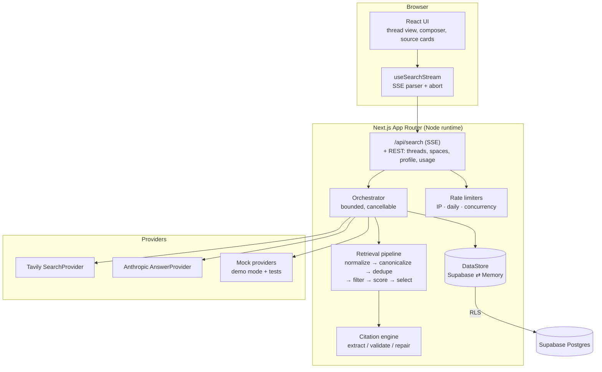
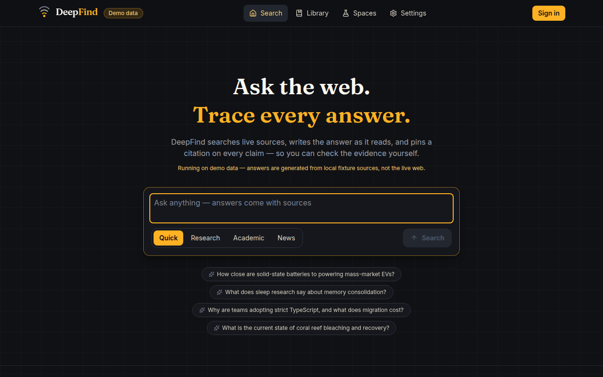

# DeepFind

**Ask the web. Trace every answer.**

DeepFind is a full-stack AI answer engine: you ask a question, the server searches
the live web, ranks and selects the strongest sources, and an LLM writes a streamed
Markdown answer grounded _exclusively_ in that evidence. Every factual claim carries
an inline citation chip (`[1]`, `[2]`) that maps to a real, stored source card —
click a chip and the matching card is highlighted; click a card and the original
page opens safely in a new tab.

> Original product: DeepFind's branding, visual design, copy, components and
> information architecture are its own. It shares only the product _category_
> with tools like Perplexity.

## Features

- **Four search modes** — Quick (one pass, direct answer), Research (bounded
  iterative loop producing a structured report), Academic (papers, DOIs, preprint
  labeling, BibTeX export), News (recency-weighted, time-range filter, publication
  timestamps).
- **Streaming answers** over Server-Sent Events with typed protocol events:
  status stages, sources, tokens, citation validation, usage, completion, errors.
- **Citation integrity** — server-side validation of every citation against the
  stored source set, one controlled repair pass that strips unknown ids, and a
  visible warning when validation fails. Invalid ids are never silently rendered.
- **Threads** — persistent conversations with follow-up questions (capped,
  summarized history), regenerate, copy, save, rename, delete, share.
- **Library** — searchable, filterable (mode / date / saved / workspace),
  cursor-paginated history.
- **Workspaces (Spaces)** — group threads and attach custom AI instructions that
  steer every search launched from the workspace.
- **Public sharing** — unguessable 192-bit share tokens; unsharing invalidates
  the link; the raw thread URL never grants access to non-owners.
- **Auth** — Supabase magic-link + Google OAuth when configured; anonymous
  sessions with a limited free-search allowance; a clearly-labelled local demo
  account when Supabase is absent.
- **Demo mode** — the complete product runs with zero external API keys on
  deterministic fixtures, marked with an unmissable "Demo data" badge.
- **Usage controls** — anonymous/daily limits, per-IP rate limiting, concurrency
  caps, provider timeouts, retry with backoff (transient failures only).

## Architecture



Deep dives: [docs/ARCHITECTURE.md](docs/ARCHITECTURE.md) ·
[docs/SEARCH_PIPELINE.md](docs/SEARCH_PIPELINE.md) ·
[docs/SECURITY.md](docs/SECURITY.md) · [docs/DEPLOYMENT.md](docs/DEPLOYMENT.md)

## Stack and versions

| Layer      | Package                                                | Version                 |
| ---------- | ------------------------------------------------------ | ----------------------- |
| Framework  | `next` (App Router)                                    | 15.5.x                  |
| UI         | `react` / `react-dom`                                  | 19.2.x                  |
| Language   | `typescript` (strict)                                  | 5.9                     |
| Styling    | `tailwindcss`                                          | 4.3.x                   |
| Primitives | `@radix-ui/react-dialog`, `-dropdown-menu`             | 1.x / 2.x               |
| LLM        | `@anthropic-ai/sdk`                                    | 0.109.x                 |
| Data/Auth  | `@supabase/supabase-js` / `@supabase/ssr`              | 2.110.x / 0.12.x        |
| Validation | `zod`                                                  | 4.4.x                   |
| Rendering  | `react-markdown` + `remark-gfm`                        | 10.x / 4.x              |
| Tests      | `vitest` / `@playwright/test` / `@axe-core/playwright` | 4.1.x / 1.61.x / 4.12.x |

No LangChain — the retrieval pipeline is small, custom and auditable.

## Quick start (demo mode, no keys)

```bash
npm install
cp .env.example .env
# edit .env: set DEMO_MODE=true
npm run dev
# open http://localhost:3000
```

Everything works: search, streaming, citations, follow-ups, threads, library,
spaces, sharing, a demo sign-in. Data lives in memory (resets on restart) and a
"Demo data" badge is always visible. Demo answers are generated from local
fixture sources — never presented as live web results. Four rich fixture topics
ship out of the box (solid-state batteries, sleep & memory, TypeScript adoption,
coral reefs) plus a generic corpus for any other query.

## Live mode

```bash
# .env
DEMO_MODE=false
ANTHROPIC_API_KEY=sk-ant-...
ANTHROPIC_MODEL=claude-sonnet-5
TAVILY_API_KEY=tvly-...
SEARCH_PROVIDER=tavily
NEXT_PUBLIC_SUPABASE_URL=https://<project>.supabase.co
NEXT_PUBLIC_SUPABASE_ANON_KEY=...
SUPABASE_SERVICE_ROLE_KEY=...
```

Environment is validated at startup with Zod
([lib/config/env.ts](lib/config/env.ts)); missing or inconsistent variables
produce a readable error listing every problem instead of a runtime crash.
All variables are documented in [.env.example](.env.example).

### Supabase setup

1. Create a project at [supabase.com](https://supabase.com).
2. Apply migrations (either way):
   ```bash
   # with the Supabase CLI linked to your project
   supabase db push
   # or paste supabase/migrations/0001_init.sql then 0002_rls.sql
   # into the SQL editor, in order
   ```
3. Auth → Providers: enable **Email** (magic link). Optionally enable **Google**
   (OAuth client id/secret) — the login page offers it automatically.
4. Auth → URL configuration: set the site URL and add
   `https://<your-app>/auth/callback` to redirect URLs.
5. Optional: run [supabase/verify-rls.sql](supabase/verify-rls.sql) in the SQL
   editor to assert the row-level-security behaviour.

Persistence selection is automatic: with all three Supabase variables set (and
demo mode off) the app uses Postgres; otherwise it falls back to a non-durable
in-memory store and says so at `/api/health`.

## Commands

```bash
npm run dev              # start dev server
npm run build            # production build
npm run start            # serve the production build
npm run typecheck        # strict TypeScript, no emit
npm run lint             # ESLint (next/core-web-vitals + next/typescript)
npm run test             # Vitest unit tests        (tests/unit)
npm run test:integration # Vitest integration tests (tests/integration)
npm run test:e2e         # Playwright e2e + axe accessibility audit (demo mode)
npm run format           # Prettier write
npm run format:check     # Prettier check
```

E2E tests build and boot the app in demo mode on port 3100 with mock providers —
they never spend API credits.

## Performance notes (measured locally, production build)

- First streamed answer token typically arrives **< 1.5 s** after submit in demo
  mode; sources render before the answer starts (the SSE protocol emits
  `sources` ahead of `token` events).
- Pages are server components except where interactivity requires a client
  component (composer, thread view, library, dialogs).
- First Load JS is ~103 kB shared; the heaviest route (`/thread/[threadId]`,
  markdown rendering + streaming) is ~189 kB.
- Library and thread history use cursor pagination; thread detail fetches
  sources with two batched queries rather than per-message roundtrips.
- Streaming UI appends tokens into a single state value; markdown re-renders are
  bounded by React batching, and citation linkification is memoized.

## API cost drivers

| Driver                  | Where                                                                     | Control                                          |
| ----------------------- | ------------------------------------------------------------------------- | ------------------------------------------------ |
| Tavily searches         | 1–3 per quick search, up to `RESEARCH_MAX_QUERIES` in research mode       | mode config, daily/anon limits                   |
| Anthropic input tokens  | source evidence block (budgeted per mode, ~14–32k chars) + capped history | `totalContextBudgetChars`, history summarization |
| Anthropic output tokens | answer length setting (1k/2k/4k max tokens)                               | `answerLength`                                   |
| Query planning          | one small non-streamed completion per search                              | falls back to heuristics on failure              |

## Screenshots

Captured from the running app in demo mode:

| Landing (search + modes)                               | Thread (sources + streamed answer)                   |
| ------------------------------------------------------ | ---------------------------------------------------- |
|  |  |

## Known limitations

- **Rate limiting is per-instance and in-memory.** It resets on deploy and does
  not coordinate across serverless instances; it is a cost/abuse _speed bump_,
  not bot protection. A Redis/Upstash adapter behind the same interface is the
  production path.
- **Anonymous limits are advisory.** Clearing cookies yields a new anonymous
  session; the per-IP limiter is the only backstop, and `x-forwarded-for` is
  spoofable without a trusted proxy in front.
- **In-memory persistence (demo / no Supabase) is non-durable** and single
  instance by design.
- **News event grouping is approximate** — near-duplicate titles are collapsed;
  true event clustering across differently-worded reports is future work.
- **Academic metadata is best-effort** from search-result parsing (DOI regex,
  domain heuristics, preprint domains). It does not query Crossref/PubMed APIs.
- **Semantic relevance** uses the search provider's relevance score (embedding
  based at Tavily) with keyword overlap as fallback — DeepFind does not run its
  own embedding model.
- **Live-mode paths were not exercised in this environment** (no Anthropic /
  Tavily / Supabase credentials available here). The Tavily client is tested
  against stubbed HTTP responses (status mapping, retry, timeout, parsing), the
  Anthropic provider follows the official SDK streaming API, and everything
  downstream of the provider interfaces is identical in demo and live modes.
- **Theme preference** ships dark-only; the settings page states this rather
  than offering a dead control.
- Cancellation registry is in-memory, so explicit cross-instance cancel (beyond
  the request's own abort signal) only works within one instance.

## Troubleshooting

| Symptom                                                    | Fix                                                                                                         |
| ---------------------------------------------------------- | ----------------------------------------------------------------------------------------------------------- |
| Startup error “Invalid environment configuration”          | The error lists each bad variable; compare with `.env.example`.                                             |
| `/api/health` shows `"persistence": "memory"` in live mode | One of the three Supabase variables is missing — all three are required together.                           |
| Magic-link email never arrives                             | Check Supabase Auth → SMTP settings and the redirect URL allowlist.                                         |
| Search fails with `rate_limited` immediately               | Per-IP limiter (default 10 searches/min). Raise `SEARCHES_PER_MINUTE_PER_IP` if you're behind a shared NAT. |
| `anonymous_limit_reached`                                  | Expected after `ANONYMOUS_SEARCH_LIMIT` searches — sign in to continue.                                     |
| E2E tests can't launch a browser                           | Set `PLAYWRIGHT_CHROMIUM_PATH` to a Chromium binary, or run `npx playwright install chromium`.              |
| Streaming stalls behind a proxy                            | Ensure the proxy does not buffer `text/event-stream` (the route already sends `X-Accel-Buffering: no`).     |
